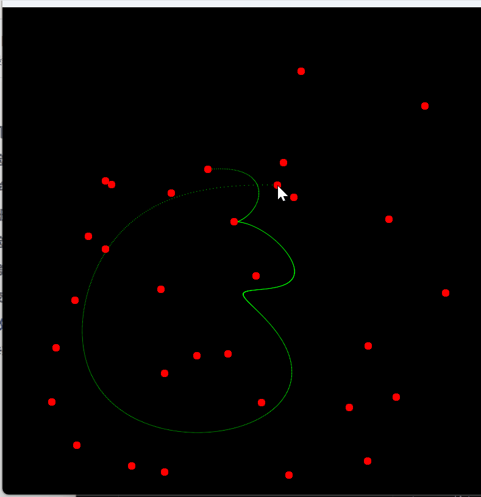

# 实验：基于 Taichi CPU 的反走样贝塞尔曲线渲染与交互

本项目利用 Taichi 语言实现了基于 De Casteljau 算法的任意阶贝塞尔曲线生成器，并针对核显环境强制使用 **CPU 后端** 进行高性能渲染。

## 功能说明

### 1. 核心算法：De Casteljau
- 原理：通过递归线性插值（Linear Interpolation）精确计算曲线轨迹。
- 实现：在 CPU 端完成高阶递归逻辑，支持动态增加控制点。

### 2. 反走样 (Anti-Aliasing) [选做题已完成]
- 背景：解决基础光栅化中因像素截断产生的“阶梯状”锯齿。
- 算法：采用了基于亚像素级精度的**高斯权重衰减模型**。通过计算生成的浮点坐标与周围像素中心的空间距离，动态分配色彩亮度。
- 效果演示：

> 演示点击添加红点，实时生成边缘平滑的绿色曲线。

---

## 运行方式

### 环境准备
本实验依赖 Python 3.12+ 及 uv 环境。

\```powershell
uv pip install taichi numpy
\```

### 执行指令
由于核显兼容性，代码已优化为强制 CPU 模式。

\```powershell
uv run main.py
\```

## 交互指南

- **添加控制点 (LMB)**：在画布上点击鼠标左键。
- **清空画布 (C 键)**：按下键盘 **C** 键清空。

> 演示清空画布功能。

---

## 技术备注

1. **后端选择**：初始化采用 `ti.init(arch=ti.cpu)` 以规避集显驱动兼容性问题。
2. **数据处理**：利用 `from_numpy` 进行 CPU 算力与计算后端 Field 的大块数据同步，确保交互无卡顿。